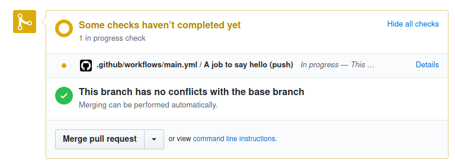

.. _Conditions:

============
 Conditions
============

Conditions are used in pull request rules to check if a pull request matches a
certain rule. If a pull request matches all of the listed conditions in a rule,
the subsequent actions listed in that rule will be applied. Conditions must be
listed under the ``conditions`` section of the ``pull_request_rules`` entries —
see :ref:`configuration file format`.

Grammar
~~~~~~~

A condition is a string that has the following format::

  [ "-" ] [ "#" ] <attribute> [ <operator> <value> ]

- The optional ``-`` prefix is equivalent to the `not` operator.

- The optional ``#`` prefix indicates to consider the length of the attribute
  value rather than its content.

- An ``attribute`` is a property of a pull request, such as its author, its
  title or its base branch.

- An ``operator`` is used to determine how the match between the pull request's
  ``attribute`` and the defined ``value`` occurs.

For example:

- ``author=jd`` evaluates to true if the GitHub login of the author of the pull
  request is ``jd``.

- ``base~=^stable/`` matches any pull request whose base branch matches the
  regular expression ``^stable/``.

- ``approved-reviews-by=sileht`` matches if the user ``sileht`` is in the list
  of contributors who approved the pull request.

- ``#approved-reviews-by>=2`` matches if at least 2 collaborators approved the
  pull request.

- ``-merged`` matches if the pull requested has not been merged.

.. warning::

   The ``#`` character is considered as a comment delimiter in YAML. As ``#``
   is the length operator in Mergify's conditions system, don't forget to use
   ``"`` around the condition to write valid YAML syntax.

.. note::

  ``operator`` and ``value`` are only optional if the ``attribute`` type is
  ``Boolean``.

Attributes
~~~~~~~~~~

Here's the list of pull request attribute that can be used in conditions:

.. list-table::
   :header-rows: 1
   :widths: 1 1 2

   * - Attribute Name
     - Value type
     - Value description
   * - ``assignee``
     - array of string
     - The list of GitHub user or team login that are assigned to the pull request.
       Team logins are prefixed with the ``@`` character and must belong to the
       repository organization.
   * - ``approved-reviews-by``
     - array of string
     - The list of GitHub user or team login that approved the pull request.
       Team logins are prefixed with the ``@`` character and must belong to the
       repository organization.
       This only matches reviewers with ``admin`` or ``write`` permission
       on the repository.
   * - ``author``
     - string
     - The GitHub user or team login of the author of the pull request.
       Team logins are prefixed with the ``@`` character and must belong to the
       repository organization.
   * - ``base``
     - string
     - The name of the branch the pull request should be pulled into.
   * - ``body``
     - string
     - The contents of the pull request.
   * - ``changes-requested-reviews-by``
     - array of string
     - The list of GitHub user or team login that have requested changes in a
       review for the pull request.
       Team logins are prefixed with the ``@`` character and must belong to the
       repository organization.
       This only matches reviewers with ``admin`` or ``write`` permission
       on the repository.
   * - ``closed``
     - Boolean
     - Whether the pull request is closed.
   * - ``conflict``
     - Boolean
     - Whether the pull request is conflicting with its base branch.
   * - ``commented-reviews-by``
     - array of string
     - The list of GitHub user or team login that have commented in a review
       for the pull request.
       Team logins are prefixed with the ``@`` character and must belong to the
       repository organization.
       This only matches reviewers with ``admin`` or ``write`` permission
       on the repository.
   * - ``dismissed-reviews-by``
     - array of string
     - The list of GitHub user or team login that have their review dismissed
       in the pull request.
       Team logins are prefixed with the ``@`` character and must belong to the
       repository organization.
       This only matches reviewers with ``admin`` or ``write`` permission
       on the repository.
   * - ``files``
     - string
     - The files that are modified, deleted or added by the pull request.
   * - ``head``
     - string
     - The name of the branch where the pull request changes are implemented.
   * - ``label``
     - array of string
     - The list of labels of the pull request.
   * - ``locked``
     - Boolean
     - Whether the pull request is locked.
   * - ``merged``
     - Boolean
     - Whether the pull request is merged.
   * - ``merged-by``
     - string
     - The GitHub user or team login that merged the pull request.
       Team logins are prefixed with the ``@`` character and must belong to the
       repository organization.
   * - ``milestone``
     - string
     - The milestone title associated to the pull request.
   * - ``review-requested``
     - array of string
     - The list of GitHub user or team login that were requested to review the
       pull request.
       Team logins are prefixed with the ``@`` character and must belong to the
       repository organization.
       This only matches reviewers with ``admin`` or ``write`` permission
       on the repository.
   * - ``status-success``
     - array of string
     - The list of status checks that successfuly passed for the pull request.
       This is the name of a *status check* such as
       `continuous-integration/travis-ci/pr` or of a *check run* such as
       `Travis CI - Pull Request`. See `Status Check Name`_ for more
       details.
   * - ``status-neutral``
     - array of string
     - The list of status checks that are neutral for the pull request.
       This is the name of a *status check* such as
       `continuous-integration/travis-ci/pr` or of a *check run* such as
       `Travis CI - Pull Request`. See `Status Check Name`_ for more
       details.
   * - ``status-failure``
     - array of string
     - The list of status checks that failed for the pull request.
       This is the name of a *status check* such as
       `continuous-integration/travis-ci/pr` or of a *check run* such as
       `Travis CI - Pull Request`. See `Status Check Name`_ for more
       details.
   * - ``title``
     - string
     - The title of the pull request.

.. note::

   When the attributes type is an array, the :ref:`Operators` have a different
   behaviour and check against every value of the array. There is no need to
   use a different syntax.

.. _Operators:

Operators
~~~~~~~~~

.. list-table::
   :header-rows: 1
   :widths: 2 1 3

   * - Operator Name
     - Symbol
     - Operator Description
   * - Equal
     - ``=`` or ``:``
     - This operator checks for strict equality. If the target attribute type
       is an array, each element of the array is compared against the value and
       the condition is true if any value matches.
   * - Not Equal
     - ``!=`` or ``≠``
     - This operator checks for non equality. If the target attribute type
       is an array, each element of the array is compared against the value and
       the condition is true if no value matches.
   * - Match
     - ``~=``
     - This operator checks for regular expression matching. If the target
       attribute type is an array, each element of the array is matched
       against the value and the condition is true if any value matches.
   * - Greater Than or Equal
     - ``>=`` or ``≥``
     - This operator checks for the value to be greater than or equal to the
       provided value. It's usually used to compare against the length of an
       array using the ``#`` prefix.
   * - Greater Than
     - ``>``
     - This operator checks for the value to be greater than the provided
       value. It's usually used to compare against the length of an array using
       the ``#`` prefix.
   * - Lesser Than or Equal
     - ``<=`` or ``≤``
     - This operator checks for the value to be lesser then or equal to the
       provided value. It's usually used to compare against the length of an
       array using the ``#`` prefix.
   * - Lesser Than
     - ``<``
     - This operator checks for the value to be lesser than the provided
       value. It's usually used to compare against the length of an array using
       the ``#`` prefix.

Impementing Or Conditions
~~~~~~~~~~~~~~~~~~~~~~~~~

The `conditions` do not support the `or` operation. As Mergify evaluates and
apply every matching rules from your configuration, you can implement multiple
rules in order to have this.

For example, to automatically merge a pull request if its author is ``foo`` or
``bar``, you could write:

.. code-block:: yaml

    pull_request_rules:
      - name: automatic merge if author is foo
        conditions:
          - author=foo
          - status-success=Travis CI - Pull Request
        actions:
          merge:
            method: merge

    pull_request_rules:
      - name: automatic merge if author is bar
        conditions:
          - author=foo
          - status-success=Travis CI - Pull Request
        actions:
          merge:
            method: merge

Status Check Name
~~~~~~~~~~~~~~~~~

Generic Status Check
++++++++++++++++++++

When using the ``status-success``, ``status-neutral`` and ``status-failure``
conditions, you need to use the name of your check service. This can be find by
opening an existing pull request and scrolling down near the ``Merge`` button.

.. image:: _static/status-check-example.png
   :alt: Status check example

The name of the status check is written in bold on the left side. In the
example above, it should be ``Uno.UI - CI``. A condition that would make sure
this checks succeed before doing any action should be written as:

.. code-block:: yaml

     conditions:
       - status-success=Uno.UI - CI

GitHub Actions
++++++++++++++

GitHub Actions works slightly differently. To match a status check when using
GitHub Action, only the job name is used.

In the example above, it would be ``A job to say hello``:

.. code-block:: yaml

     conditions:
       - status-success=A job to say hello
