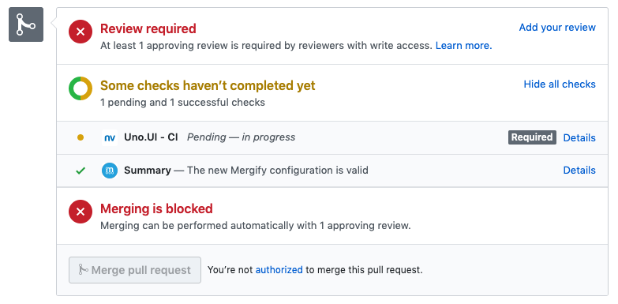

.. _Conditions:

============
 Conditions
============

Conditions are used in pull request rules to check if a pull request matches a
certain rule. If a pull request matches all of the listed conditions in a rule,
the subsequent action listed in that rule will be applied. Conditions must be
listed under the ``conditions`` section of the ``pull_request_rules`` entries —
see :ref:`configuration file format`.

Grammar
~~~~~~~

A condition is a string that has the following format::

  [ "-" ] [ "#" ] <attribute> [ <operator> <value> ]

An ``attribute`` is a property of a pull request, such as its author, its title
or its base branch. An ``operator`` is used to determine how the match between
the pull request's ``attribute`` and the defined ``value`` will occur.

For example, the condition ``author=jd`` will be evaluated to true if the
GitHub login of the author of the pull request is ``jd``. The condition
``base~=^stable/`` will match any pull request whose base branch matches the
regular expression ``^stable/``.

The special ``#`` prefix indicates to consider the length of the attribute
rather than its content. For example, ``approved-reviews-by=sileht`` will match
if the user ``sileht`` approved the pull request. However,
``#approved-reviews-by>=2`` will match if at least 2 collaborators approved the
pull request.

.. warning::

   The ``#`` character is considered as the comment delimiter in YAML. ``#`` is
   also the length operator in Mergify's conditions system, therefore don't
   forget to use ``"`` around the condition.

``operator`` and ``value`` are not mandatory if the ``attribute`` type is
``Boolean``.

The special ``-`` prefix is equivalent to the `not` operator.

Attribute List
~~~~~~~~~~~~~~

Here's the list of pull request attribute that rules can be matched against:

.. list-table::
   :header-rows: 1
   :widths: 1 1 2

   * - Attribute Name
     - Value type
     - Value description
   * - ``assignee``
     - array of string
     - The list of GitHub user or team login that are assigned to the pull request.
       Team logins are prefixed with the ``@`` character.
   * - ``approved-reviews-by``
     - array of string
     - The list of GitHub user or team login that approved the pull request.
       Team logins are prefixed with the ``@`` character.
       This will match only reviewers with ``admin`` or ``write`` permission
       on the repository.
   * - ``author``
     - string
     - The GitHub user or team login of the author of the pull request.
       Team logins are prefixed with the ``@`` character.
   * - ``base``
     - string
     - The name of the branch the pull request should be pulled into.
   * - ``body``
     - string
     - The contents of the pull request.
   * - ``changes-requested-reviews-by``
     - array of string
     - The list of GitHub user or team login that have requested changes in a
       review for the pull request.
       Team logins are prefixed with the ``@`` character.
       This will match only reviewers with ``admin`` or ``write`` permission
       on the repository.
   * - ``closed``
     - Boolean
     - Whether the pull request is closed.
   * - ``conflict``
     - Boolean
     - Whether the pull request is conflicting with its base branch.
   * - ``commented-reviews-by``
     - array of string
     - The list of GitHub user or team login that have commented in a review
       for the pull request.
       Team logins are prefixed with the ``@`` character.
       This will match only reviewers with ``admin`` or ``write`` permission
       on the repository.
   * - ``dismissed-reviews-by``
     - array of string
     - The list of GitHub user or team login that have their review dismissed
       in the pull request.
       Team logins are prefixed with the ``@`` character.
       This will match only reviewers with ``admin`` or ``write`` permission
       on the repository.
   * - ``files``
     - string
     - The files that are modified, deleted or added by the pull request.
   * - ``head``
     - string
     - The name of the branch where the pull request changes are implemented.
   * - ``label``
     - array of string
     - The list of labels of the pull request.
   * - ``locked``
     - Boolean
     - Whether the pull request is locked.
   * - ``merged``
     - Boolean
     - Whether the pull request is merged.
   * - ``merged-by``
     - string
     - The GitHub user or team login that merged the pull request.
       Team logins are prefixed with the ``@`` character.
   * - ``milestone``
     - string
     - The milestone title associated to the pull request.
   * - ``review-requested``
     - array of string
     - The list of GitHub user or team login that were requested to review the
       pull request. Team logins are prefixed with the ``@`` character.
       This will match only reviewers with ``admin`` or ``write`` permission
       on the repository.
   * - ``status-success``
     - array of string
     - The list of status checks that successfuly passed for the pull request.
       This is the name of a *status check* such as
       `continuous-integration/travis-ci/pr` or of a *check run* such as
       `Travis CI - Pull Request`. See `About status check name`_ for more
       details.
   * - ``status-neutral``
     - array of string
     - The list of status checks that are neutral for the pull request.
       This is the name of a *status check* such as
       `continuous-integration/travis-ci/pr` or of a *check run* such as
       `Travis CI - Pull Request`. See `About status check name`_ for more
       details.
   * - ``status-failure``
     - array of string
     - The list of status checks that failed for the pull request.
       This is the name of a *status check* such as
       `continuous-integration/travis-ci/pr` or of a *check run* such as
       `Travis CI - Pull Request`. See `About status check name`_ for more
       details.
   * - ``title``
     - string
     - The title of the pull request.

Operators List
~~~~~~~~~~~~~~

.. list-table::
   :header-rows: 1
   :widths: 2 1 3

   * - Operator Name
     - Symbol
     - Operator Description
   * - Equal
     - ``=`` or ``:``
     - This operator checks for strict equality. If the target attribute type
       is an array, each element of the array is compared against the value.
   * - Not Equal
     - ``!=`` or ``≠``
     - This operator checks for non equality. If the target attribute type
       is an array, each element of the array is compared against the value.
   * - Match
     - ``~=``
     - This operator checks for regular expression matching. If the target
       attribute type is an array, each element of the array is matched
       against the value.
   * - Greater Than or Equal
     - ``>=`` or ``≥``
     - This operator checks for the value to be greater than or equal to the
       provided value. It's usually used to compare against the length of an
       array using the ``#`` prefix.
   * - Greater Than
     - ``>``
     - This operator checks for the value to be greater than the provided
       value. It's usually used to compare against the length of an array using
       the ``#`` prefix.
   * - Lesser Than or Equal
     - ``<=`` or ``≤``
     - This operator checks for the value to be lesser then or equal to the
       provided value. It's usually used to compare against the length of an
       array using the ``#`` prefix.
   * - Lesser Than
     - ``<``
     - This operator checks for the value to be lesser than the provided
       value. It's usually used to compare against the length of an array using
       the ``#`` prefix.

.. note::

    For all `reviewers` related attributes, only users with `write` or `admin`
    permission on the repository are used, others are ignored.

About status check name
~~~~~~~~~~~~~~~~~~~~~~~

When using the ``status-success`` and ``status-failure`` conditions, you need
to use the name of your check service.

This can be find by opening an existing pull request and scrolling down near
the ``Merge`` button.

The name of the status check is written in bold on the left side. In the
example above, it should be ``Uno.UI - CI``. A condition that would make sure
this checks succeed before doing any action should be written as:

.. code-block:: yaml

     conditions:
       - status-success=Uno.UI - CI

Examples
~~~~~~~~

Matching Pull Requests Passing Travis and Being Approved
--------------------------------------------------------

Those conditions will match any pull request that has been approved by two
reviewers and where Travis CI passes.

.. code-block:: yaml

     conditions:
       - "#approved-reviews-by>=2"
       - status-success=continuous-integration/travis-ci/pr

If you want to ignore pull request that has a negative review, you can enhance
this condition set like this:

.. code-block:: yaml

     conditions:
       - "#approved-reviews-by>=2"
       - status-success=continuous-integration/travis-ci/pr
       - "#changes-requested-reviews-by=0"

This can make sure that any pull request that has a change for request in a
review is not matched.

Matching Merged Pull Requests
-----------------------------

Matching merged pull requests is straight forward:

.. code-block:: yaml

     conditions:
       - merged

On the other hand, matching unmerged pull requests can be done with:

.. code-block:: yaml

     conditions:
       - -merged
