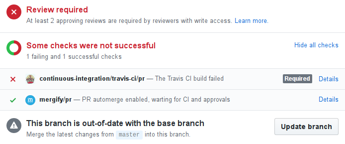
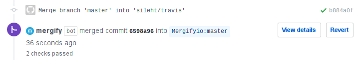

===============
Getting Started
===============

Installation
------------

In order to work, Mergify needs access to your account and to be enabled. To do so, start by logging in using your GitHub account at https://mergify.io/dashboard.

Once this is done, you need to enable the Mergify GitHub Application on the repositories you want. Go to https://github.com/apps/mergify/installations/new and enroll repositories where you want Mergify to be enabled.

Configuration
-------------

In the root directory of each enabled repository, create a `.mergify.yml` file with the minimal content to apply the defaults policies:

.. code-block:: shell

    $ cd myrepository
    $ echo "policies:" > .mergify.yml
    $ git add .mergify.yml
    $ git commit -m "Enable mergify.io"
    $ git push

A more realistic example of the `.mergify.yml` file would look like :

.. code-block:: yaml

    policies:
      default:
        required_status_checks:
          contexts:
            - continuous-integration/travis-ci
        required_pull_request_reviews:
          required_approving_review_count: 2

The key `default` stores the default merging rules to use on all branches. The `required_status_checks` lists all checks that must pass before merging a pull request.
The `required_pull_request_reviews` defines how many reviewer of the repository should approve the pull request before it gets merged.

You can define a per branch policy using the `branches` settings. To match multiple branches at once, you can use a regular expression:

.. code-block:: yaml

    policies:
      default:
        required_status_checks:
          contexts:
            - continuous-integration/travis-ci
        required_pull_request_reviews:
          required_approving_review_count: 2
      branches:
        stable/.*:
          required_pull_request_reviews:
            required_approving_review_count: 1

Mergify supports every available GitHub branch protection feature. You can read
more detail on each `feature in GitHub branch API documentation
<https://developer.github.com/v3/repos/branches/#update-branch-protection>`_.

Mergify.io is now ready, what will happen next?
-----------------------------------------------

When a contributor sends a pull request to the repository, Mergify will post a status check about the state
of the pull request according to the defined rules.

When all criterias of the policies are satisfied, Mergify will merge the base branch into the pull request if the pull request is not up-to-date with the base branch. This is made to ensure that the pull request is tested one last time while being up-to-date with the base branch.

Once the required services status are approved, Mergify will automatically merge the pull request.

You can follow the state of the Mergify merge queue at https://mergify.io/dashboard

Now, that Mergify.io is setup, you can go back on what matters for your project and let us babysit your pull requests!
