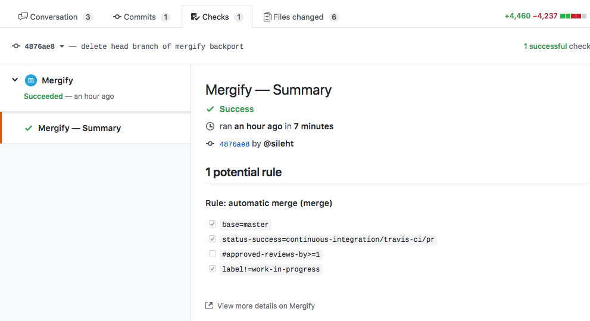

===============
Getting Started
===============

Installation
------------

In order to work, Mergify needs access to your account and to be enabled. To do
so, start by logging in using your GitHub account at
https://mergify.io/dashboard. On first login, you will be asked to give
some permissions on your behalf for Mergify to work.

Once this is done, you need to enable the Mergify GitHub Application on the
repositories you want. Go to https://github.com/apps/mergify/installations/new
and enroll repositories where you want Mergify to be enabled.

Configuration
-------------

Basics
~~~~~~

In order for Mergify to apply your rules to your pull requests, you need to
create a configuration file. The configuration file should be created in the
root directory of each enabled repository and named ``.mergify.yml``. The
configuration file format is entirely documented in :ref:`configuration file
format`.

Here's how to create a file with a minimal content to enable Mergify:

.. code-block:: shell

    $ cd myrepository
    $ echo "pull_request_rules:" > .mergify.yml
    $ git add .mergify.yml
    $ git commit -m "Enable mergify.io"
    $ git push

Since this file does not contain any specific rules, Mergify won't do anything.
So let's create a rule to make it useful!

Creating Rules
~~~~~~~~~~~~~~

A more realistic example of a ``.mergify.yml`` file would look like this:

.. code-block:: yaml

    pull_request_rules:
      - name: automatic merge on CI success and review
        conditions:
          - status-success=continuous-integration/travis-ci/pr
          - "#approved-reviews-by>=2"
        actions:
          merge:
            method: merge

The ``name`` of the rule is not used directly by Mergify, but is really useful
when Mergify will report its status and for debugging rules. We advise setting
an explicity name that makes sense to you.

The key ``conditions`` defines the list of conditions that a pull request must
match in order for the engine to execute the configured actions. In this
example, there are 2 conditions to be met for the rule to be applied to a pull
request:

- ``status-success=continuous-integration/travis-ci/pr``: the ``status-success``
  variable contains all the check services that successfully run on this pull
  request. In this case, it must contains ``continuous-integration/travis-ci/pr``
  for the rule to match: that would mean that the Travis CI reported a success
  status check.

- ``#approved-reviews-by>=2``: the ``approved-reviews-by`` variable contains
  the list of collaborators that approved the pull request and, in this case,
  it must contains at least 2 members (note the ``#`` length operator used
  here).

.. warning::

   The ``#`` character is considered as the comment delimiter in YAML. ``#`` is
   also the length operator in Mergify's conditions system, therefore don't
   forget to use ``"`` around the condition.

In this example, two reviewers must approve the pull request and the Travis CI
must pass before Mergify executes the action: merging the pull request.

The merge of the pull request is enabled by specifying the ``merge`` action
with a ``method`` parameter containing the merge method to use.

You can define any number of rules using any of the available conditions
criterias; each rule that match will see its action executed.

Fore more details about the configuration file format, check
:ref:`configuration file format`.

Mergify is now ready, what happens next?
----------------------------------------

When a user sends a pull request to the repository, Mergify will post a status
check about the state of the pull request according to the defined rules.

.. note::

   When a pull request changes the configuration of Mergify, the status is
   built with the current configuration (without the pull request change). The
   Mergify configuration is validated and status is posted in the ``Summary``
   check.

When all the criterias of the rules are satisfied, Mergify will do the
configure actions, such as merging the pull request.

Now, that Mergify. is setup, you can go back on what matters for your project
and let us babysit your pull requests!
