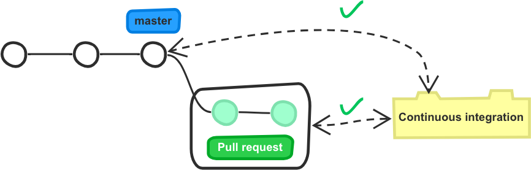
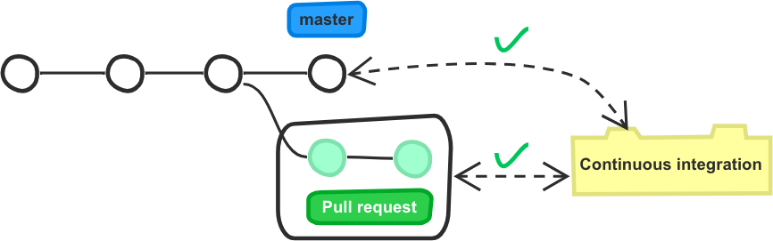
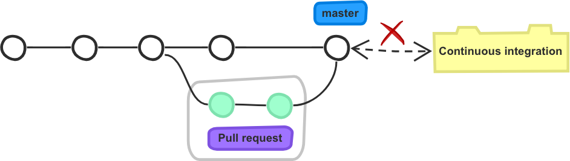

.. _strict merge:

===============
Strict Merge
===============

The *strict* merge workflow is a workflow that prevents merging broken pull
requests. That situation can arise when outdated pull requests are being merged
in their base branch.

Understanding the Problem
=========================

To understand what the problem is, imagining the following situation: the base
branch (e.g., ``master``) has its continuous integration testing passing
correctly.  A passing pull request is created then. The state of the repository
can be represented like this:

While the pull request stays open, another commit is pushed to ``master``. That
can be a local commit or a merge commit from another pull request; who knows.
The tests are run against ``master`` and they pass. The state of the continuous
integration system is now reflected as this:

The pull request is still marked as valid by the continuous integration system
since it did not change. Therefore, the pull request is considered as
_mergeable_: the merge button is green.

If you click that merge button, this is what might happens:

As a new merge commit is created to merge the pull request, it is possible that
the continuous integration testing will fail. Indeed: a new test might have
been added in master while the pull request was open, and that pull request may
not have the correct code to pass this new test.

By pressing the merge button, you just broke your continuous integration
system, and probably your software. Good work.

The Strict Workflow Solution
============================

The *strict* workflow solves that issue by updating any pull request that is
not up-to-date with its base branch before being merged. That forces the
continuous integration system to test again the pull request with the new code.

In the previous example, the continuous integration system would have marked the
pull request as failing the test, removing it from the mergeable candidate.

When the *strict* workflow is enabled, Mergify takes care of merging the target
branch in any pull request that is not up-to-date with its target branch. If
multiple pull requests are mergeable, they are scheduled to be merged
sequentially, and they will be updated on top of each other.

The pull request branch update is only done when the pull request is ready to
be merged by the engine, e.g., when the status checks are OK and the number of
postive reviews are enough.

Enabling the Strict Workflow
============================

To enable the *strict* workflow, you need to set the value of ``strict`` to
``true`` in the :ref:`merge action` action.

To enable it on a pull request, you can write a ``mergify.yml`` like this:

.. code-block:: yaml

    pull_request_rules:
      - name: automatic merge with strict
        conditions:
          - "#approved-reviews-by>=2"
          - status-success=continuous-integration/travis-ci
        actions:
          merge:
            method: merge
            strict: true
