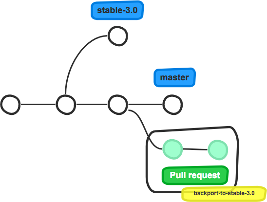
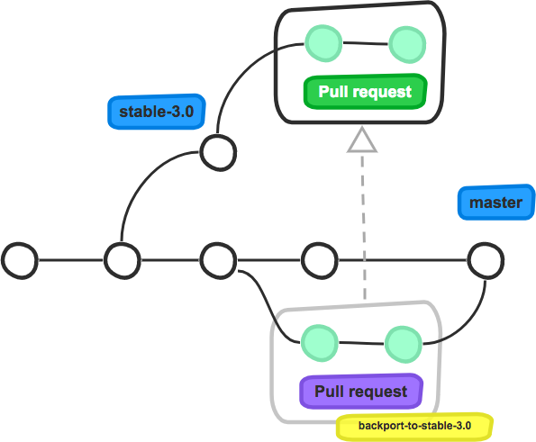

==================
Automated Backport
==================

It is common for software to have (some of) their major versions maintained
over an extended period. Developers usually create stable branches that are
maintained for a while by cherry-picking patches from the development branch.

This process is called *backporting* as it implies that bug fixes merged into
the development branch are ported back to the stable branch. The stable branch
can then be used to release a new minor version of the software, fixing some of
its bugs.

As this process of backporting patches can be tedious, Mergify automates this
mechanism to save developers' time and ease their duty.

How It Works
============

Automated backport can be enabled by configuring the
``automated_backport_labels`` option in your ``.mergify.yml``. This option
consists of a dictionary where the keys are `labels
<https://help.github.com/articles/about-labels/>`_ name and values are branch
names.

When a pull request is merged and labeled with one of the keys, a new pull
request is created on the branch associated to the key. The new pull request
has all commits cherry-picked from the original pull request. Pull requests
can also be labeled after they are merged.

For example, the following configuration creates new pull requests to backport
merged pull requests. Pull requests labeled with ``backport-to-stable-3.0``
that are merged into any branch are backported to ``stable-3.0``::

  rules:
    default:
      automated_backport_labels:
        backport-to-stable-3.0: stable-3.0

When the pull request is created and labeled with ``backport-to-stable-3.0``,
Mergify waits for the pull request to be merged.

As soon as the labeled pull request is merged, Mergify creates a new pull
request targetting the ``stable-3.0`` branch that carries over the commits
included in the original labeled pull request.

This new pull request can be merged following your usual criteria for its
targetting branch.
