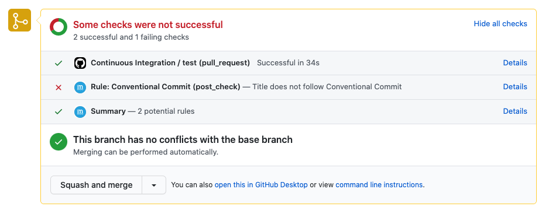

.. meta::
   :description: Mergify Documentation for Post Check Action
   :keywords: mergify, post, check
   :summary: Post custom status check to a pull request.
   :doc:icon: check

.. _post_check action:

post_check
==========

|premium plan tag|

The ``post_check`` action adds an item in a pull request check list. The check
status is ``success`` when all conditions match, otherwise, it is set to
``failure``.

Options
-------

.. list-table::
  :header-rows: 1
  :widths: 1 1 1 2

  * - Key Name
    - Value Type
    - Default
    - Value Description

  * - ``title``
    - :ref:`data type template`
    -
    - The title of the check.

  * - ``summary``
    - :ref:`data type template`
    -
    - The summary of the check.

As the ``title`` and ``summary`` use on :ref:`data type template`, you can
benefit from any pull request attributes, e.g. ``{{author}}``, and also these
additional variables:

    * ``{{ check_rule_name }}`` the name of the rule that triggered this action.
    * ``{{ check_succeed }}`` is ``True`` if all conditions matches otherwise ``False``
    * ``{{ check_conditions }}`` the list of all conditions with a checkbox marked if the condition match

Examples
--------

📜 Enforcing Conventional Commits
~~~~~~~~~~~~~~~~~~~~~~~~~~~~~~~~~

You might want to enforce some guidelines as how to write pull request title.
The following rules add such a check, making sure your team follows
`Conventional Commits <https://www.conventionalcommits.org/>`_.

.. code-block:: yaml

    pull_request_rules:
      - name: Conventional Commit
        conditions:
          - "title~=^(fix|feat|docs|style|refactor|perf|test|build|ci|chore|revert)(?:\\(.+\\))?:"
        actions:
          post_check:
            title: |
              
              Title follows Conventional Commit
              
              Title does not follow Conventional Commit
              
            summary: |
              
              Your pull request title must follow [Conventional Commit](https://www.conventionalcommits.org/en/v1.0.0/).
              

The result of this check will be visible in GitHub user interface, near the
merge button.

.. include:: ../global-substitutions.rst
