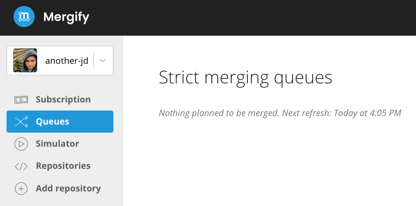

.. meta::
   :description: Mergify Documentation for Queue Action
   :keywords: mergify, queue, pull request
   :summary: Put a pull request in queue before merging.
   :doc:icon: train

.. _queue action:

queue
=====

The ``queue`` action moves the pull request into one of the merge queue defined
in :ref:`queue rules`.

Merge queues prevent merging broken pull requests by serializing their merge.
Merging broken pull requests can happen when outdated pull requests are being
merged in their base branch.

Mergify always respects the `branch protection`_ settings. When the conditions
match and the ``queue`` action runs, Mergify waits for the branch protection to
be validated before embarking and merging the pull request.

.. _`branch protection`: https://docs.github.com/en/github/administering-a-repository/about-protected-branches

Mergify also waits for dependent pull requests to get merged first (see :ref:`merge-depends-on`).

Why Queues?
-----------

.. _merge queue problem:

To understand the problem queues resolve, imagine the following situation:

- The base branch (e.g., ``main``) has its continuous integration testing
  passing correctly.

- A pull request is created, which also passes the CI.

The state of the repository can be represented like this:

.. graphviz:: strict-mode-master-pr-ci-pass.dot
   :alt: Pull request is open

While the pull request is open, another commit is pushed to ``main`` — let's
call it `new commit`. That new commit can be pushed directly to ``main`` or
merged from another pull request; it doesn't matter.

The tests are run against the ``main`` branch by the CI, and they pass. The
state of the repository and its continuous integration system can be now
described like this:

.. graphviz:: strict-mode-new-master-pr-ci-pass.dot
   :alt: Base branch adds a new commit

The pull request is still marked as valid by the continuous integration system
since it did not change. As there is no code conflict, the pull request is
considered as `mergeable` by GitHub: the merge button is green.

If you click that merge button, this is what `might` happen:

.. graphviz:: strict-mode-merge-ci-fail.dot
   :alt: Base branch is broken

As a new merge commit is created to merge the pull request, it is possible that
the continuous integration testing fails. Indeed, the continuous integration
did not test the pull request with the `new commit` added to the base branch.
This `new commit` might have introduced some new tests in the base branch while
the pull request was open. That pull request may not have the correct code to
pass this new test.

Using Queues
~~~~~~~~~~~~

Using a merge queue solves that issue by updating any pull request that is not
up-to-date with its base branch before being merged. That forces the continuous
integration system to retest the pull request with the new code from its base
branch.

If a merge queue were being used in the previous example, Mergify would
automatically merge the ``main`` in the base branch. The continuous integration
system would have rerun and marked the pull request as failing the test,
removing it from the merge queue altogether.

.. graphviz:: strict-mode-rebase-ci-fail.dot
   :alt: Rebase make CI fails

When multiple pull requests are mergeable, they are scheduled to be merged
sequentially, and are updated on top of each other. The pull request branch
update is only done when the pull request is ready to be merged by the engine,
e.g., when all the `conditions` are validated.

That means that when a first pull request has been merged, and the second one
is outdated like this:

.. graphviz:: queue-strict-merge-pr2-open.dot
   :alt: strict merge with PR2 open

Mergify will make sure the pull request #2 is updated with the latest tip of
the base branch before merging:

.. graphviz:: queue-strict-merge.dot
   :alt: strict merge

That way, there's no way to merge a broken pull request into the base branch.

Configuring the Merge Queues
----------------------------

The `merge queues` rely on two configuration items: the ``queues_rules`` and
the ``queue`` action.

The ``queue`` action places the pull request inside the merge queue: the set of
conditions described in the ``pull_request_rules`` allows the pull request to
enter the queue when all conditions match.

If the ``queue`` action conditions do not match anymore, the pull request is
removed from the merge queue.

When a pull request is at the top of the queue, Mergify looks at the second set
of conditions defined this time in ``queue_rules`` and wait that they all match
to merge the pull request.

When multiple queues are defined, they are processed one after the other in the
order they are defined in the ``queue_rules`` list. Queue processing is blocked
until all preceding queues are empty.

Viewing the Merge Queue
-----------------------

The merge queue can be visualized from your `dashboard <https://dashboard.mergify.io>`_:

.. _speculative checks:

Speculative Checks
------------------

|premium plan tag|

Merging pull requests one by one serially can take a lot of time, depending on
the continuous integration run time. To merge pull requests faster, Mergify
queues support `speculative checks`.

With speculative checks, the first pull requests from the queue are embarked in
a `merge train` and tested together in parallel so they can be merged faster. A
merge train consists of two or more pull requests embarked together to be
tested speculatively. To test them, Mergify creates temporary pull requests
where multiple queued pull requests are merged together.

The upside of creating multiple temporary pull requests is that continuous
integration pipelines can run on all of them in parallel. Currently, Mergify
embarks up from 1 to 20 pull requests into the merge train (you can set the
value with the ``speculative_checks`` settings in ``queue_rules``).

.. graphviz:: queue-strict-train.dot
   :alt: Merge train
   :caption: A merge queue with 5 pull requests and ``speculative_checks`` set to 3

In the above example, three pull requests are tested at the same time by the
continuous integration system: ``PR #1``, ``PR #1 + PR #2`` and ``PR #1 + PR #2
+ PR#3``. By creating temporary pull requests that combine multiple pull
requests, Mergify is able to schedule in advance the testing of the combined
results of every pull request in the queue.

Those temporary pull requests check if the resulting branch can be merged
according to the ``queue_rules`` conditions. If any of the merge car fails to
match the ``queue_rules`` conditions, the culprit pull request is removed from
the queue.

When the pull request ``PR #1 + PR #2`` matches the ``queue_rules`` conditions,
the pull requests ``PR #1`` and ``PR #2`` are merged and the temporary pull
request ``PR #1 + PR #2`` is deleted. The same goes for the pull request ``PR
#1 + PR #2 + PR #3`` and ``PR #3``.

In the case where a new commit is pushed on the base branch, Mergify resets the
merge train and starts over the process.

If an embarked pull request doesn't match the ``queue_rules`` anymore, it is
removed from the merge train. All pull requests embarked after it are
disembarked and re-embarked.

Options
-------

Queue Action
~~~~~~~~~~~~

These are the options of the ``queue`` action:

.. list-table::
   :header-rows: 1
   :widths: 1 1 1 3

   * - Key Name
     - Value Type
     - Default
     - Value Description
   * - ``name``
     - string
     -
     - The name of the merge queue where to move the pull request.
   * - ``method``
     - string
     - ``merge``
     - Merge method to use. Possible values are ``merge``, ``squash`` or
       ``rebase``.
   * - ``rebase_fallback``
     - string
     - ``merge``
     - If ``method`` is set to ``rebase``, but the pull request cannot be
       rebased, the method defined in ``rebase_fallback`` will be used instead.
       Possible values are ``merge``, ``squash``, ``none``. ``none`` will
       report an error if rebase is not possible.
   * - ``merge_bot_account``
     - string
     -
     - |premium plan tag|
       Mergify can impersonate a GitHub user to merge pull request.
       If no ``merge_bot_account`` is set, Mergify will merge the pull request
       itself. The user account **must** have already been
       logged in Mergify dashboard once and have **write** or **maintain** permission.

   * - ``priority``
     - 1 <= integer <= 10000 or ``low`` or ``medium`` or ``high``
     - ``medium``
     - |premium plan tag| This sets the priority of the pull request in the queue. The pull
       request with the highest priority is merged first.
       ``low``, ``medium``, ``high`` are aliases for ``1000``, ``2000``, ``3000``.

   * - ``commit_message``
     - string
     - ``default``
     - Defines what commit message to use when merging using the ``squash`` or
       ``merge`` method. Possible values are:

       * ``default`` to use the default commit message provided by GitHub
         or defined in the pull request body (see :ref:`commit message`).

       * ``title+body`` means to use the title and body from the pull request
         itself as the commit message. The pull request number will be added to
         end of the title.

.. _queue rules:

Queue Rules
~~~~~~~~~~~

A ``queue_rules`` takes the following parameter:

.. list-table::
   :header-rows: 1
   :widths: 1 1 1 3

   * - Key Name
     - Value Type
     - Default
     - Value Description
   * - ``name``
     - string
     -
     - The name of the merge queue.
   * - ``conditions``
     - list of :ref:`Conditions`
     -
     - The list of ``conditions`` to match to get the queued pull request merged.
   * - ``speculative_checks``
     - int
     - 1
     - |premium plan tag| The maximum number of checks to run in parallel in the queue. Must be
       between 1 and 20.
       See :ref:`speculative checks`.

.. important::

   |premium plan tag|
   Defining multiple queue rules is only available for `Premium subscribers <https://mergify.io/pricing>`_.

Examples
--------

🐛 Single Queue
~~~~~~~~~~~~~~~

A simple usage of the queue is to merge pull requests serially, ensuring they
all pass the CI one after the other. The following example defines a queue
named ``default`` which allows any pull request to be merged once it enters it.

To enter the queue, pull requests need to be based on the ``main`` branch, have
2 approving reviews and pass the CI. Once a pull request is in first position
in the queue, it will be updated with the latest commit of its base branch.

.. code-block:: yaml

    queue_rules:
      - name: default
        conditions:
          - check-success=Travis CI - Pull Request

    pull_request_rules:
      - name: merge using the merge queue
        conditions:
          - base=main
          - "#approved-reviews-by>=2"
          - check-success=Travis CI - Pull Request
        actions:
          queue:
            name: default

🚥 Multiple Queues
~~~~~~~~~~~~~~~~~~
|premium plan tag|

By using multiple queues, it's possible to put some pull requests in a higher
priority queue. As queues are processed one after the other, the following
example allow to add a label ``urgent`` to a pull request so it gets put in the
higher priority queue.

.. code-block:: yaml

    queue_rules:
      - name: urgent
        conditions:
          - check-success=Travis CI - Pull Request

      - name: default
        conditions:
          - check-success=Travis CI - Pull Request

    pull_request_rules:
      - name: move to urgent queue when 2 reviews and label urgent
        conditions:
          - base=main
          - "#approved-reviews-by>=2"
          - label=urgent
        actions:
          queue:
            name: urgent

      - name: merge using the merge queue
        conditions:
          - base=main
          - "#approved-reviews-by>=2"
          - check-success=Travis CI - Pull Request
          - label!=urgent
        actions:
          queue:
            name: default

With such a configuration, a pull request with the label ``urgent`` will get
into the queue as soon as it's approved by 2 developers but before the CI has
even run on it. It will be in front of the ``default`` queue. Mergify will
update the pull request with its base branch if necessary, wait for the CI to
pass and then merge the pull request.

🎲 Speculative Checks
~~~~~~~~~~~~~~~~~~~~~
|premium plan tag|

If your continuous integration system takes a long time to validate the
enqueued pull requests, it might be interesting to enable :ref:`speculative
checks <speculative checks>`. This will allow Mergify to trigger multiple runs
of the CI in parallel.

In the following example, by setting the ``speculative_checks`` option to
``3``, Mergify will create up to new 2 pull requests to check if the first
three enqueued pull requests are mergeable.

.. code-block:: yaml

    queue_rules:
      - name: default
        speculative_checks: 3
        conditions:
          - check-success=Travis CI - Pull Request

    pull_request_rules:
      - name: merge using the merge queue and speculative checks
        conditions:
          - base=main
          - "#approved-reviews-by>=2"
          - check-success=Travis CI - Pull Request
        actions:
          queue:
            name: default

.. _merge-depends-on:

⛓️ Defining Pull Request Dependencies
-------------------------------------

|premium plan tag|
|open source plan tag|

You can specify dependencies between pull requests from the same repository.
Mergify waits for the linked pull requests to be merged before merging any pull
request with a ``Depends-On:`` header.

To use this feature, adds the ``Depends-On:`` header to the body of your pull
request:

.. code-block:: md

    New awesome feature 🎉

    To get the full picture, you may need to look at these pull requests:

    Depends-On: #42
    Depends-On: https://github.com/organization/repository/pull/123

.. warning::

    This feature does not work for cross-repository dependencies.

.. include:: ../global-substitutions.rst
