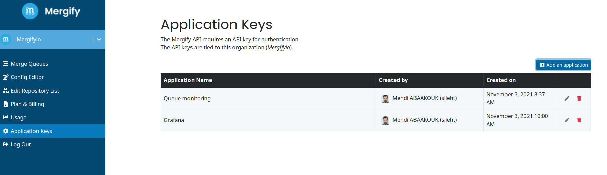
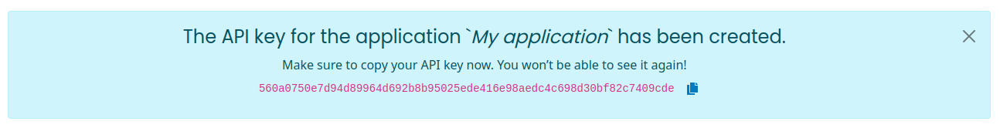

.. meta::
   :description: Mergify API
   :keywords: mergify, api

======
🔌 API
======

Mergify provides a RESTful API that you can use to get the data you need to
integrate with Mergify.

The API endpoint is located at ``https://api.mergify.com/v1/``.

Authentication
==============

First, you need to create an Application that will be tied to your Organization on the `dashboard <https://dashboard.mergify.com>`_.

Once the application is created, the dashboard will give you an API key.

Then you can use the API key to authenticate against the API. You can check the
token is valid by retrieving the application information:

.. code-block:: shell

    # curl -H "Accept: application/json" -H "Authorization: Bearer <my-application-api-key>" https://api.mergify.com/v1/application
    {
        "id": 123,
        "name": "my application",
        "github_account": {
            "id": 123,
            "login": "Mergify",
            "type": "Organization",
        }
    }

Going Further
=============

You can check the `API references <https://docs.mergify.com/api>`_ to discover
all the data you can access.
