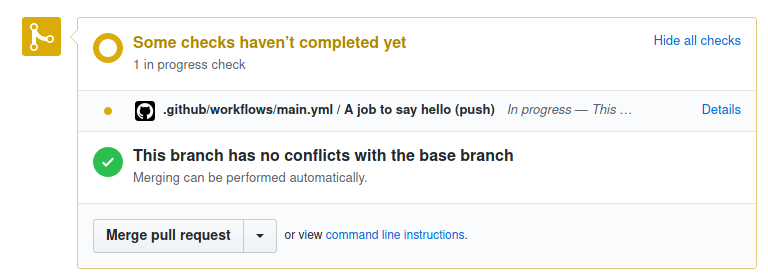

.. meta::
   :description: Mergify Documentation for Conditions
   :keywords: mergify, conditions

.. _Conditions:

=============
🎯 Conditions
=============

Conditions are used in pull request rules and queue rules to check if a pull
request matches a certain rule. If a pull request matches all of the listed
conditions in a rule, the subsequent actions listed in that rule will be
applied. Conditions must be listed under the ``conditions`` section of the
``pull_request_rules`` or ``queue_rules`` entries — see :ref:`configuration file format`.

Grammar
~~~~~~~

A condition is a string that has the following format::

  [ "-" ] [ "#" ] <attribute> [ <operator> <value> ]

.. important::

   The ``#`` character is considered as a comment delimiter in YAML. As ``#``
   is the length operator in Mergify's conditions system, don't forget to use
   ``"`` around the condition to write valid YAML syntax.

.. note::

  ``operator`` and ``value`` are only optional if the ``attribute`` type is
  ``Boolean``.

- The optional ``-`` prefix is equivalent to the `not` operator.

- The optional ``#`` prefix indicates to consider the length of the attribute
  value rather than its content.

- An ``attribute`` is a property of a pull request, such as its author, its
  title or its base branch.

- An ``operator`` is used to determine how the match between the pull request's
  ``attribute`` and the defined ``value`` occurs.

For example:

- ``author=jd`` evaluates to true if the GitHub login of the author of the pull
  request is ``jd``.

- ``base~=^stable/`` matches any pull request whose base branch matches the
  regular expression ``^stable/``.

- ``approved-reviews-by=sileht`` matches if the user ``sileht`` is in the list
  of contributors who approved the pull request.

- ``#approved-reviews-by>=2`` matches if at least 2 collaborators approved the
  pull request.

- ``-merged`` matches if the pull requested has not been merged.

Combining Conditions with Operators
~~~~~~~~~~~~~~~~~~~~~~~~~~~~~~~~~~~

The `conditions` do support the ``or`` and ``and`` operators.

For example, you can match if its author is ``foo`` or
``bar``, you could write:

.. code-block:: yaml

    conditions:
      - or:
        - author=foo
        - author=bar

You can also combine ``or`` and ``and`` like this:

.. code-block:: yaml

    conditions:
      - or:
        - and:
            author=foo
            label=core
        - and:
            author=bar
            label=backend

.. important::

    The number of nested conditions is limited to 3.

.. _attributes:

Attributes
~~~~~~~~~~

Here's the list of pull request attribute that can be used in conditions:

.. list-table::
   :header-rows: 1
   :widths: 1 1 2

   * - Attribute Name
     - Value type
     - Value description
   * - ``assignee``
     - list of string
     - The list of GitHub user or team login that are assigned to the pull request.
       Team logins are prefixed with the ``@`` character and must belong to the
       repository organization.
   * - ``approved-reviews-by``
     - list of string
     - The list of GitHub user or team login that approved the pull request.
       Team logins are prefixed with the ``@`` character and must belong to the
       repository organization.
       This only matches reviewers with ``admin``, ``write`` or ``maintain``
       permission on the repository.
   * - ``author``
     - string
     - The GitHub user or team login of the author of the pull request.
       Team logins are prefixed with the ``@`` character and must belong to the
       repository organization.
   * - ``base``
     - string
     - The name of the branch the pull request should be pulled into.
   * - ``body``
     - string
     - The contents of the pull request.
   * - ``changes-requested-reviews-by``
     - list of string
     - The list of GitHub user or team login that have requested changes in a
       review for the pull request.
       Team logins are prefixed with the ``@`` character and must belong to the
       repository organization.
       This only matches reviewers with ``admin``, ``write`` or ``maintain``
       permission on the repository.
   * - ``closed``
     - Boolean
     - Whether the pull request is closed.
   * - ``conflict``
     - Boolean
     - Whether the pull request is conflicting with its base branch.
   * - ``commented-reviews-by``
     - list of string
     - The list of GitHub user or team login that have commented in a review
       for the pull request.
       Team logins are prefixed with the ``@`` character and must belong to the
       repository organization.
       This only matches reviewers with ``admin``, ``write`` or ``maintain``
       permission on the repository.
   * - ``dismissed-reviews-by``
     - list of string
     - The list of GitHub user or team login that have their review dismissed
       in the pull request.
       Team logins are prefixed with the ``@`` character and must belong to the
       repository organization.
       This only matches reviewers with ``admin``, ``write`` or ``maintain``
       permission on the repository.
   * - ``draft``
     - Boolean
     - Whether the pull request is in draft state.
   * - ``files``
     - list of string
     - The files that are modified, deleted or added by the pull request.
   * - ``head``
     - string
     - The name of the branch where the pull request changes are implemented.
   * - ``label``
     - list of string
     - The list of labels of the pull request.
   * - ``locked``
     - Boolean
     - Whether the pull request is locked.
   * - ``merged``
     - Boolean
     - Whether the pull request is merged.
   * - ``merged-by``
     - string
     - The GitHub user or team login that merged the pull request.
       Team logins are prefixed with the ``@`` character and must belong to the
       repository organization.
   * - ``milestone``
     - string
     - The milestone title associated to the pull request.
   * - ``number``
     - integer
     - The pull request number.
   * - ``review-requested``
     - list of string
     - The list of GitHub user or team login that were requested to review the
       pull request.
       Team logins are prefixed with the ``@`` character and must belong to the
       repository organization.
       This only matches reviewers with ``admin``, ``write`` or ``maintain``
       permission on the repository.
   * - ``check-success``
     - list of string
     - The list of status checks that successfully passed for the pull request.
       This is the name of a *status check* such as
       `continuous-integration/travis-ci/pr` or of a *check run* such as
       `Travis CI - Pull Request`. See `About Status Checks`_ for more
       details.
   * - ``check-neutral``
     - list of string
     - The list of status checks that are neutral for the pull request.
       This is the name of a *status check* such as
       `continuous-integration/travis-ci/pr` or of a *check run* such as
       `Travis CI - Pull Request`. See `About Status Checks`_ for more
       details.
   * - ``check-success-or-neutral``
     - list of string
     - The list of status checks that successfully passed or are neutral for
       the pull request.
       This is the name of a *status check* such as
       `continuous-integration/travis-ci/pr` or of a *check run* such as
       `Travis CI - Pull Request`. See `About Status Checks`_ for more
       details.
   * - ``check-failure``
     - list of string
     - The list of status checks that failed for the pull request.
       This is the name of a *status check* such as
       `continuous-integration/travis-ci/pr` or of a *check run* such as
       `Travis CI - Pull Request`. See `About Status Checks`_ for more
       details.
       Checks that report being cancelled, timed out, and action
       required are also considered as failures.
   * - ``check-skipped``
     - list of string
     - The list of status checks that was skipped for the pull request.
       This is the name of a *status check* such as
       `continuous-integration/travis-ci/pr` or of a *check run* such as
       `Travis CI - Pull Request`. See `About Status Checks`_ for more
       details.
   * - ``check-pending``
     - list of string
     - The list of status checks that is pending for the pull request.
       This is the name of a *status check* such as
       `continuous-integration/travis-ci/pr` or of a *check run* such as
       `Travis CI - Pull Request`. See `About Status Checks`_ for more
       details.
   * - ``check-stale``
     - list of string
     - The list of status checks that are stale for the pull request.
       This is the name of a *status check* such as
       `continuous-integration/travis-ci/pr` or of a *check run* such as
       `Travis CI - Pull Request`. See `About Status Checks`_ for more
       details.
   * - ``title``
     - string
     - The title of the pull request.
   * - ``updated-at``
     - :ref:`time interval` or :ref:`Datetime <iso datetime>`
     - The last time the pull request was updated.
       (example: 7 days 18:10)
   * - ``current-time``
     - string
     - The current time in format ``HH:MM``.
   * - ``current-day``
     - integer
     - The current day of the month, from 1 to 31.
   * - ``current-month``
     - integer
     - The current month, from 1 to 12.
   * - ``current-year``
     - integer
     - The current year, from 1900 to 9999.
   * - ``current-day-of-week``
     - integer or string
     - The current day of the week. From 1 (Monday) to 7 (Sunday), or one of
       ``Mon``, ``Tue``, ``Wed``, ``Thu``, ``Fri``, ``Sat``, ``Sun``
       ``Monday``, ``Tuesday``, ``Wednesday``, ``Thursday``, ``Friday``,
       ``Saturday``, ``Sunday``. Weeks start on Monday.
   * - ``schedule``
     - string
     - A schedule, e.g., ``Mon-Fri``, ``12:00-18:00`` or ``Mon-Fri 12:00-18:00``

.. important::

   Time-based conditions have a 5 minutes precision at best. Do not write
   conditions based on time ranges that are too narrow or the condition might
   never be true.

   ``current-time`` and ``updated-at`` do not support ``~=``, ``=`` and ``!=`` operators.
   ``schedule`` only supports ``=`` and ``!=``.

.. _Operators:

Operators
~~~~~~~~~

.. list-table::
   :header-rows: 1
   :widths: 2 1 3

   * - Operator Name
     - Symbol
     - Operator Description
   * - Equal
     - ``=`` or ``:``
     - This operator checks for strict equality. If the target attribute type
       is a list, each element of the list is compared against the value and
       the condition is true if any value matches.
   * - Not Equal
     - ``!=`` or ``≠``
     - This operator checks for non equality. If the target attribute type
       is a list, each element of the list is compared against the value and
       the condition is true if no value matches.
   * - Match
     - ``~=``
     - This operator checks for :ref:`regular expressions <regular
       expressions>` matching. If the target attribute type is a list, each
       element of the list is matched against the value and the condition is
       true if any value matches.
   * - Greater Than or Equal
     - ``>=`` or ``≥``
     - This operator checks for the value to be greater than or equal to the
       provided value. It's usually used to compare against the length of a
       list using the ``#`` prefix.
   * - Greater Than
     - ``>``
     - This operator checks for the value to be greater than the provided
       value. It's usually used to compare against the length of a list using
       the ``#`` prefix.
   * - Lesser Than or Equal
     - ``<=`` or ``≤``
     - This operator checks for the value to be lesser then or equal to the
       provided value. It's usually used to compare against the length of a
       list using the ``#`` prefix.
   * - Lesser Than
     - ``<``
     - This operator checks for the value to be lesser than the provided value.
       It's usually used to compare against the length of a list using the
       ``#`` prefix.

How To Match Lists
~~~~~~~~~~~~~~~~~~~

Some attributes have a type of ``list``. Most `Operators`_ are able to match
value against lists: they will iterate over all the values of the list and
return true if any of the value matches.

For example, the ``label`` attribute is a list of string containing the names
of the label attached to a pull request. With a pull request whose labels are
``(bug, work-in-progress)``, then:

- ``label=work-in-progress`` is **true** because there is a label named
  ``work-in-progress``.

- ``label=enhancement`` is **false** because there is no label named
  ``enhancement``.

- ``label!=work-in-progress`` is **false** because there is a label named
  ``work-in-progress``.

- ``label~=^work`` is **true** because there is a label matching the regular
  expression ``^work``.

- ``-label~=^work`` is **false** because there is a label matching the regular
  expression ``^work`` but the condition is reversed with the ``-`` prefix.

The same applies for the ``files`` attribute — which contains the list of
modified files:

- ``files=README`` is **true** if the file ``README`` is modified in the pull
  request.

- ``files!=README`` is **true** if the file ``README`` is not modified in the
  pull request.

- ``files~=^src/`` is **true** if any files in the ``src`` directory is
  modified in the pull request.

- ``-files~=^src/`` is **true** if none of the files that are modified are in
  the ``src`` directory.

About Status Checks
~~~~~~~~~~~~~~~~~~~

Generic Status Check
++++++++++++++++++++

When using the ``check-success``, ``check-neutral``, ``check-failure``,
``check-skipped``, ``check-pending``, and ``check-stale``
conditions, you need to use the name of your check service. This can be find by
opening an existing pull request and scrolling down near the ``Merge`` button.

.. image:: _static/status-check-example.png
   :alt: Status check example

The name of the status check is written in bold on the left side. In the
example above, it should be ``Uno.UI - CI``. A condition that would make sure
this checks succeed before doing any action should be written as:

.. code-block:: yaml

     conditions:
       - check-success=Uno.UI - CI

GitHub Actions
++++++++++++++

GitHub Actions works slightly differently. To match a status check when using
GitHub Action, only the job name is used.

In the example above, it would be ``A job to say hello``:

.. code-block:: yaml

     conditions:
       - check-success=A job to say hello

Validating All Status Checks
++++++++++++++++++++++++++++

A common condition is to require that "every status check (CI) passes" —
especially before executing the :ref:`merge action` action.

**There is no such thing as "every status check" in GitHub.**

Here's why:

1. Each pull request can have its own custom list of status checks.
2. On creation, or when a new commit is pushed, a pull request has **no**
   status check.
3. A status check might not be reported by a service (CI) (e.g., because it's
   broken) and therefore be absent.

Those three facts make it **mandatory** to write explicitly the checks that are
expected for your condition to be valid. Therefore you must list explicitly
every status check that is expected, e.g.:

.. code-block:: yaml

     conditions:
       - check-success=build: Windows
       - check-success=build: Linux

**Do not** use conditions such as:

- ``#check-failure=0``, because this will be true as soon as the pull request is
  created and before any service report its status (see point 2. above).

- ``check-success~=build`` while expecting this to wait for "all" status checks
  that have ``build`` in their name (see point 1. and 2.above).

Such conditions won't do what you want them to do.
