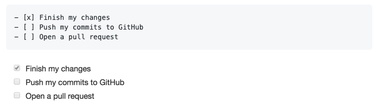

.. meta::
   :description: Mergify Configuration Examples
   :keywords: mergify, examples

.. _examples:

=================
🧪 Example Rules
=================

Mergify allows you to define a lot of specific rules and workflows. There is a
large number of :ref:`criterias <attributes>` available to define rules: pull
request author, base branch, labels, files, etc.

In this section, we build a few examples that should help you getting started
and cover many common use cases.

.. contents::
   :local:
   :depth: 1

✅ Automatic Merge when CI works and approving reviews
~~~~~~~~~~~~~~~~~~~~~~~~~~~~~~~~~~~~~~~~~~~~~~~~~~~~~~

This is a classic! That rule enables Mergify automatic merge when the
continuous integration system validates the pull request and a human reviewed
it.

.. code-block:: yaml

    pull_request_rules:
      - name: automatic merge for main when CI passes and 2 reviews
        conditions:
          - "#approved-reviews-by>=2"
          - check-success=Travis CI - Pull Request
          - base=main
        actions:
          merge:
            method: merge

Of course, you need to adapt the ``check-success`` condition to reflect which
CI system you use.

You can tweak this rule as you want. For example, you could use a label such as
``work-in-progress`` to indicate that a pull request is not ready to be merged
— even if's approved:

.. code-block:: yaml

    pull_request_rules:
      - name: automatic merge for main when CI passes and 2 reviews and not WIP
        conditions:
          - "#approved-reviews-by>=2"
          - check-success=Travis CI - Pull Request
          - base=main
          - label!=work-in-progress
        actions:
          merge:
            method: merge

You might want to merge a pull request only if it has been approved by a
certain member. You could therefore write such a rule:

.. code-block:: yaml

    pull_request_rules:
      - name: automatic merge for main when CI passes approved by octocat
        conditions:
          - approved-reviews-by=octocat
          - check-success=Travis CI - Pull Request
        actions:
          merge:
            method: merge

🗂 Merging based on Modified Files
~~~~~~~~~~~~~~~~~~~~~~~~~~~~~~~~~

You could decide to only merge some pull requests based on the files they
touch. You can use the ``files`` attribute to access the modified file list and
``#files`` to access the number of files.

This tweak is useful when you want Mergify to merge only data files which can
be validated by a script or a linter.

The below sample merges only if ``data.json`` changed and if the pull request
passes Circle CI's validation tests:

.. code-block:: yaml

    pull_request_rules:
      - name: automatic merge on CircleCI success if only data.json is changed
        conditions:
          - "check-success=ci/circleci: validate"
          - files=data.json
          - "#files=1"
        actions:
          merge:
            method: merge

You can also match patterns using regular expression. The following rule merges
the pull requests when the CI passes and when all the files are inside the
``src/`` directory:

.. code-block:: yaml

    pull_request_rules:
      - name: automatic merge on CircleCI success if only data.json is changed
        conditions:
          - "check-success=ci/circleci: validate"
          - -files~=^(!?src/)
        actions:
          merge:
            method: merge

🏖 Less Strict Rules for Stable Branches
~~~~~~~~~~~~~~~~~~~~~~~~~~~~~~~~~~~~~~~

Some projects like having easier review requirements for maintenance branches.
That usually means having e.g. 2 review requested for merging into ``main``,
but only one for a stable branch — since those pull request are essentially
backport from ``main``.

To automate the merge in this case, you could write some rules along those:

.. code-block:: yaml

    pull_request_rules:
      - name: automatic merge for main when reviewed and CI passes
        conditions:
          - "check-success=ci/circleci: my_testing_job"
          - "#approved-reviews-by>=2"
          - base=main
        actions:
          merge:
            method: merge
      - name: automatic merge for stable branches
        conditions:
          - "check-success=ci/circleci: my_testing_job"
          - "#approved-reviews-by>=1"
          - base~=^stable/
        actions:
          merge:
            method: merge

🎬 Using Labels to Enable/Disable Merge
~~~~~~~~~~~~~~~~~~~~~~~~~~~~~~~~~~~~~~~

Some developers are not comfortable with fully automatic merge — they like
having a final word before merging the code. In that case, you can add a
condition using a `label
<https://help.github.com/articles/labeling-issues-and-pull-requests/>`_:

.. code-block:: yaml

    pull_request_rules:
      - name: automatic merge for main when reviewed and CI passes
        conditions:
          - check-success=Travis CI - Pull Request
          - "#approved-reviews-by>=2"
          - base=main
          - label=ready-to-merge
        actions:
          merge:
            method: merge

As soon as the pull request has been approved by 2 contributors and gets the
label ``ready-to-be-merged``, the pull request will be merged by Mergify.

On the other hand, some developers wants an option to disable the automatic
merge feature with a label. This can be useful to indicate that a pull request
labelled as ``work-in-progress`` should not be merged:

.. code-block:: yaml

    pull_request_rules:
      - name: automatic merge for main when reviewed and CI passes
        conditions:
          - check-success=continuous-integration/travis-ci/pr
          - "#approved-reviews-by>=2"
          - base=main
          - label!=work-in-progress
        actions:
          merge:
            method: merge

In that case, if a pull request gets labelled with ``work-in-progress``, it
won't be merged, even if approved by 2 contributors and having Travis CI
passing.

⚡️ Using Labels to Prioritize Merge
~~~~~~~~~~~~~~~~~~~~~~~~~~~~~~~~~~~~

|premium plan tag|

When ``smart`` :ref:`strict merge` is enabled and many pull requests are
waiting to be merged, some of them might be more urgent. In that case, you
could add a condition using a `label
<https://help.github.com/articles/labeling-issues-and-pull-requests/>`_ and
configure the priority option of :ref:`merge action`:

.. code-block:: yaml

    pull_request_rules:
      - name: automatic merge of 🚑 hotfix (high priority)
        conditions:
          - check-success=Travis CI - Pull Request
          - "#approved-reviews-by>=2"
          - base=main
          - label=🚑 hotfix
        actions:
          merge:
            method: merge
            strict: smart
            priority: high
      - name: automatic merge of bot 🤖 (low priority)
        conditions:
          - author~=^dependabot(|-preview)\[bot\]$
          - check-success=Travis CI - Pull Request
          - "#approved-reviews-by>=2"
          - base=main
        actions:
          merge:
            method: merge
            strict: smart
            priority: low
      - name: automatic merge for main when reviewed and CI passes
        conditions:
          - check-success=Travis CI - Pull Request
          - "#approved-reviews-by>=2"
          - base=main
        actions:
          merge:
            method: merge
            strict: smart
            priority: medium

As soon as the pull request has been approved by 2 contributors, the pull
request will be added to the merge queue. Within the merge queue, the pull
requests with the label ``🚑 hotfix`` will be merged first. The pull requests
from `dependabot` will always be merged last.

🙅️ Require All Requested Reviews to Be Approved
~~~~~~~~~~~~~~~~~~~~~~~~~~~~~~~~~~~~~~~~~~~~~~~~

If all requested reviews have been approved, then the number of
``review-requested`` should become 0. That's not a sufficient condition to
merge though, as you also want to make sure there's at least one positive
review.

.. code-block:: yaml

    pull_request_rules:
      - name: merge when all requested reviews are valid
        conditions:
          - "#approved-reviews-by>=1"
          - "#review-requested=0"
          - "#changes-requested-reviews-by=0"
        actions:
            merge:
              method: merge

Note that if a requested review is dismissed, then it doesn't count as a review
that would prevent the merge.

☑️ Matching Pull Requests with Task Lists
~~~~~~~~~~~~~~~~~~~~~~~~~~~~~~~~~~~~~~~~~

`GitHub Markdown <https://guides.github.com/features/mastering-markdown/>`_
allows users to use task lists in their pull request body. Task lists render
with clickable checkboxes in comments and you can select or deselect the
checkboxes to mark them as complete or incomplete. Tasks lists are often used
in `pull request templates
<https://docs.github.com/en/communities/using-templates-to-encourage-useful-issues-and-pull-requests/creating-a-pull-request-template-for-your-repository#adding-a-pull-request-template>`_.

You can leverage Mergify conditions to match task lists using the ``body``
attribute and :ref:`regular expressions <regular expressions>`. If your body
contains the following Markdown, you can make sure those boxes are checked
before, e.g., doing a merge.

.. code-block:: markdown

    [ ] Security has been checked
    [ ] Changes have been documented

.. code-block:: yaml

   pull_request_rules
     - name: merge when checkboxes are checked
       conditions:
         - body~=(?m)^\[X\] Security has been checked
         - body~=(?m)^\[X\] Changes have been documented
         - check-success=my favorite ci
       actions:
         merge:
           method: merge

.. include:: examples/bots.rst
.. include:: global-substitutions.rst
