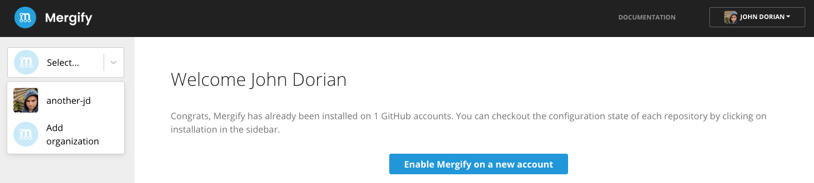
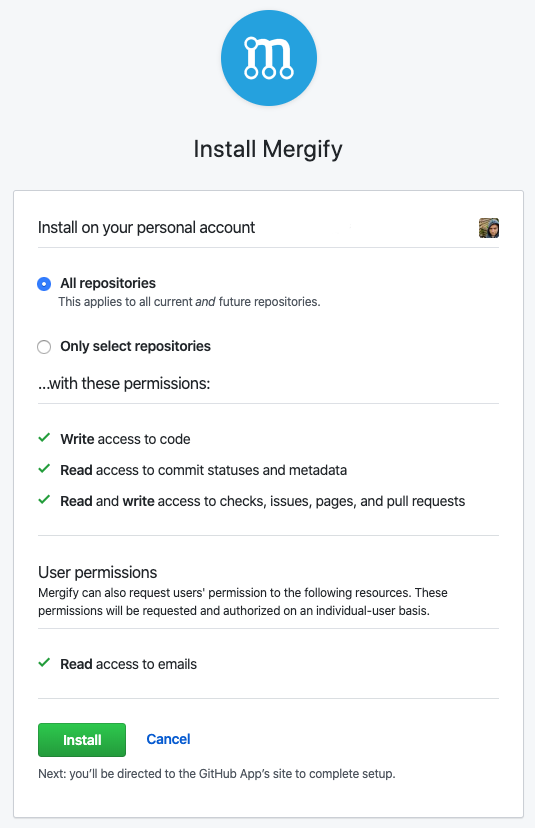
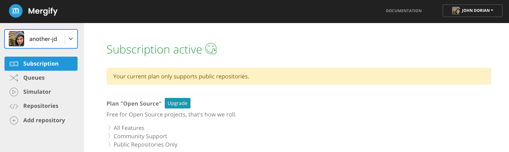
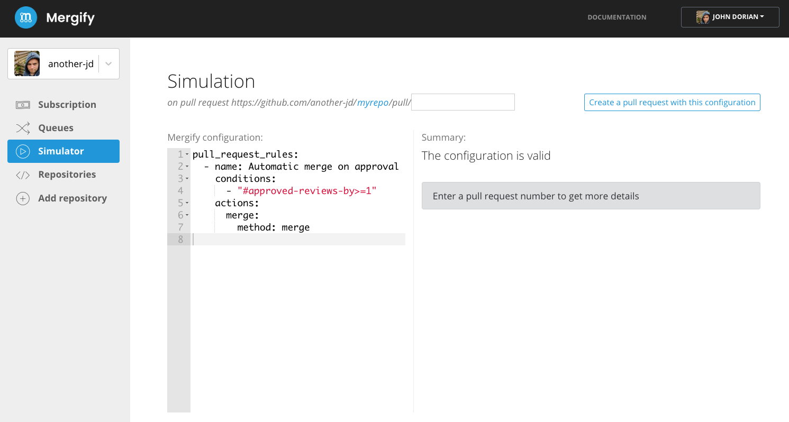
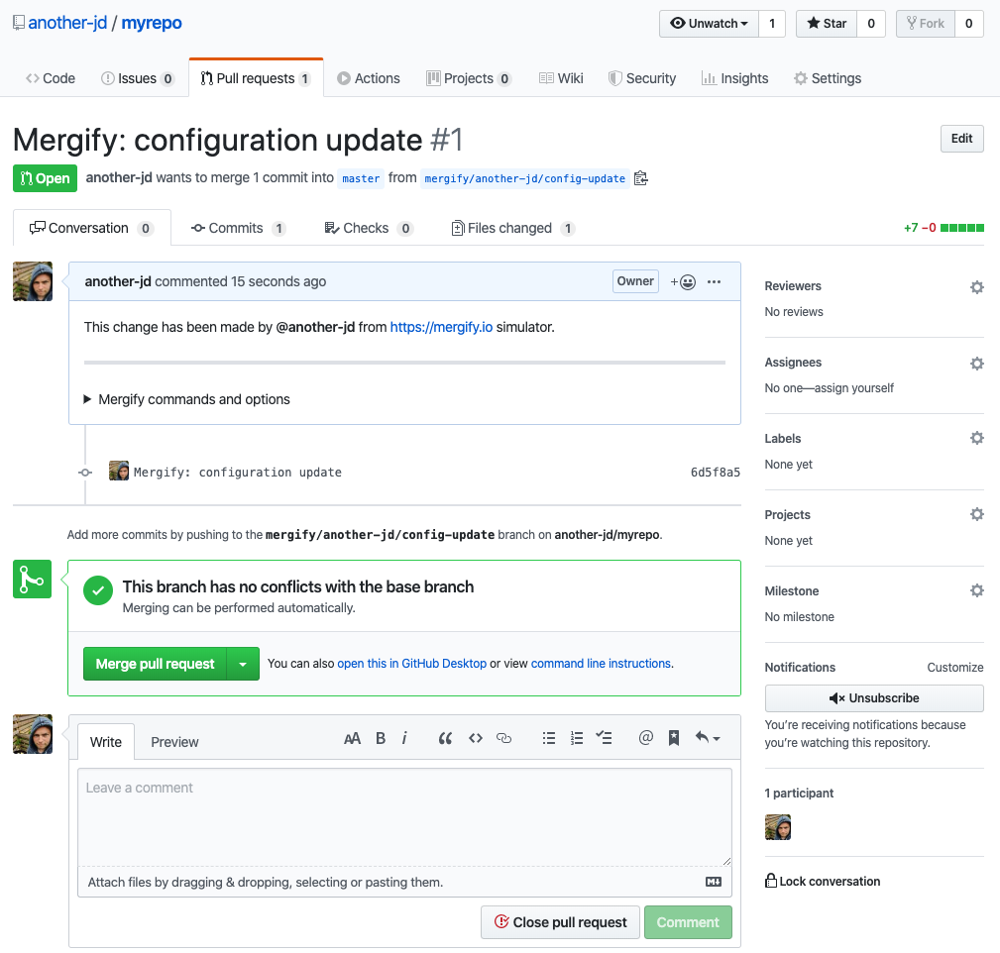
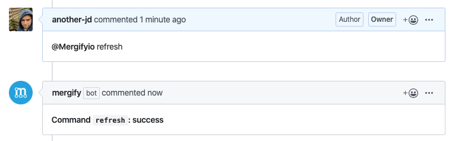

.. meta::
   :description: Introduction to Mergify Configuration and Deployment
   :keywords: mergify, automation, deployment, start

==================
➡️ Getting Started
==================

Installation
------------

Mergify is a GitHub Application that operates on your GitHub repositories to
automate them. You need to install Mergify on your GitHub Account to have it
working.

1. Login to |https://dashboard.mergify.io/|

2. Click on ``Enable Mergify on a new account`` or go to |https://github.com/apps/mergify/installations/new|

3. GitHub will now offer you to select the repositories you want to give
   Mergify access to. Select any repository you like, or all if you wish.

4. You will be redirected to the dashboard.

.. |https://dashboard.mergify.io/| raw:: html

   <a href="https://dashboard.mergify.io/" target="_blank">https://dashboard.mergify.io/</a>

.. |https://github.com/apps/mergify/installations/new| raw:: html

   <a href="https://github.com/apps/mergify/installations/new" target="_blank">https://github.com/apps/mergify/installations/new</a>

Configuration
-------------

The Configuration File
~~~~~~~~~~~~~~~~~~~~~~

Mergify applies rules to your pull requests. To do that, you need to create a
Mergify configuration in each repository where Mergify is used.

The configuration file should be created in the root directory of the
repository and named either ``.mergify.yml`` or ``.mergify/config.yml`` or ``.github/mergify.yml``.

As the file name implies, the configuration file format is based on `YAML
<https://yaml.org/>`_, a simplistic file format for data. The configuration
file format is entirely documented in :ref:`configuration file format`.

The Rules
~~~~~~~~~

The configuration file is composed of a main key named ``pull_request_rules``
which contains a list of rules.

Each rule is composed of 3 elements:

- A *name* that describes what the rule does. It's not interpreted by Mergify
  and can be anything you like that helps you identify the rule.

- A list of *conditions*. Each conditions must match for the rule to be
  applied.

- A list of *actions*. Each action will be applied as soon as the pull request
  matches the *conditions*.

A First Rule
~~~~~~~~~~~~

Let's create a first rule that will merge the pull request as soon as it has
been approved by one contributor.

Here's the relevant configuration file content:

.. code-block:: yaml

    pull_request_rules:
      - name: Automatic merge ⬇️ on approval ✔
        conditions:
          - "#approved-reviews-by>=1"
        actions:
          merge:
            method: merge

- The ``name`` of the rule is not used directly by Mergify, but is really
  useful when Mergify will report its status and for debugging rules. We advise
  setting an explicity name that makes sense to you.

- The ``conditions`` defines the list of conditions that a pull request must
  match in order for the engine to execute the configured actions. In this
  example, there is only one condition to be met for the rule to be applied to
  a pull request. The ``approved-reviews-by`` variable contains the list of
  collaborators that approved the pull request and. In this case, the variable
  must contains at least 1 member (note the length operator ``#`` used here).

- The ``action`` is to merge of the pull request. It enabled by specifying the
  ``merge`` action with a ``method`` parameter containing the merge method to
  use.

.. note::

    Mergify is event-driven: rules are only executed when pull requests are updated
    or when the bot is manually triggered in a comment with `@Mergifyio refresh` (see :ref:`Commands`).

Fore more details about the configuration file format, check
:ref:`configuration file format`.

Creating the Configuration File
~~~~~~~~~~~~~~~~~~~~~~~~~~~~~~~

You can create your configuration file using your favorite text editor.
However, writing and testing in the config editor can be easier. Go to `your
Mergify dashboard <https://dashboard.mergify.io>`_ and pick the config editor for
your organization. Then, select a repository where you enabled Mergify.

You can edit the default configuration provided as you wish. If your
repository has existing pull requests, you can test your configuration against
those by typing a pull request number in the form above.

When done, click on the ``Create a pull request with this configuration``
button. A new pull request will be created on your repository with the new
Mergify configuration. You can merge them by clicking on the merge button.

.. note::

   For security reason, Mergify will never automatically merge a pull request
   if it changes the Mergify configuration file.

Once your configuration is merged, Mergify will apply it to all your pull
requests.

Understanding Mergify Check Report
----------------------------------

When a pull request is created in the repository, Mergify posts a status check
about the state of the pull request according to the defined rules.

.. image:: _static/mergify-checks-status.png
   :alt: status check
   :align: center

.. note::

   When a pull request changes the configuration of Mergify, the status is
   built with the current configuration (without the pull request change). The
   Mergify configuration is validated and status is posted in the ``Summary``
   check.

When all the criterias of the rules are satisfied, Mergify executes the
configured actions and e.g. merges the pull request.

Controlling Mergify with Commands
---------------------------------

Mergify also exposes a set of :ref:`Commands` that you can trigger by commenting on
the pull request.

You can consult the list of those commands on the :ref:`Commands` page.
