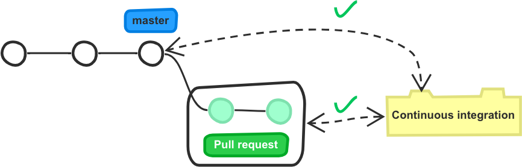
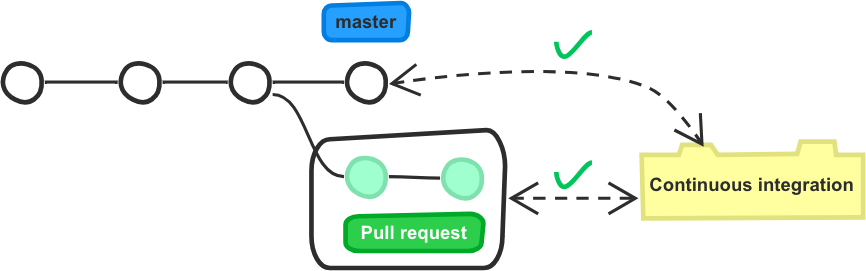
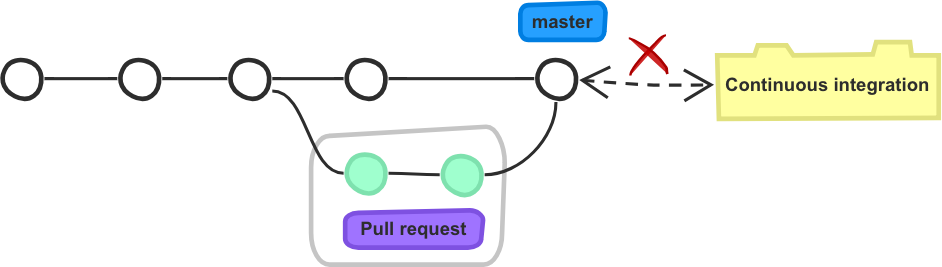
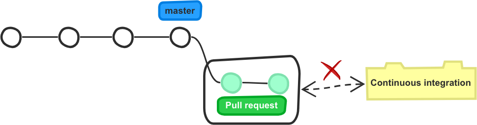

.. meta::
   :description: Mergify Merge Action Deep-dive
   :keywords: mergify, merge, action

.. _mastering merge:

=================================
🔀 Delving into the Merge Action
=================================

Mergify comes with some powerful options when it comes to merging your pull
requests. While all the options are listed in the :ref:`merge action` action
documentation, some of the combinations are detailed here.

.. _strict merge:

Strict Merge
------------

The `strict merge` option enables a workflow that prevents merging broken
pull requests. That situation can arise when outdated pull requests are being
merged in their base branch.

Understanding the Problem
=========================

To understand the problem, imagine the following situation:

- The base branch (e.g., ``master``) has its continuous integration testing
  passing correctly.

- A pull request is created, which also passes the CI.

The state of the repository can be represented like this:

While the pull request is open, another commit is pushed to ``master`` — let's
call it `new commit`. That can be a local commit or a merge commit from another
pull request; who knows. The tests are run against ``master`` by the CI and
they pass. The state of the repository and its continuous integration system
can be described like this:

The pull request is still marked as valid by the continuous integration system
since it did not change. As there is no code conflicts, the pull request is
considered as `mergeable` by GitHub: the merge button is green.

If you click that merge button, this is what `might` happens:

As a new merge commit is created to merge the pull request, it is possible that
the continuous integration testing will fail. Indeed, you never tested the pull
request with the `new commit` that has been added to the base branch. Some new
test might have been introduced by this `new commit` in the base branch while
the pull request was open. That pull request may not have the correct code to
pass this new test.

Now you realize that by pressing the merge button, you just broke your
continuous integration system, and probably your software. Good job! 🤕

The Strict Merge Solution
=========================

The `strict merge` option solves that issue by updating any pull request that
is not up-to-date with its base branch before being merged. That forces the
continuous integration system to test again the pull request with the new code.

In the previous example, if the ``strict`` option was enabled, Mergify would
have merged ``master`` in the base branch automatically. The continuous
integration system would have run again and marked the pull request as failing
the test, removing it from the mergeable candidate.

When the ``strict`` option is enabled, Mergify takes care of merging the target
branch in any pull request that is not up-to-date with its target branch. If
multiple pull requests are mergeable, they are scheduled to be merged
sequentially, and they will be updated on top of each other.

The pull request branch update is only done when the pull request is ready to
be merged by the engine, e.g., when all the `conditions` are validated.

Enabling the Strict Option
==========================

To enable `strict merge`, you need to set the value of ``strict`` to ``true``
in the :ref:`merge action` action. For example:

.. code-block:: yaml

    pull_request_rules:
      - name: automatic merge with strict
        conditions:
          - "#approved-reviews-by>=2"
          - check-success=continuous-integration/travis-ci/pr
        actions:
          merge:
            method: merge
            strict: true

Viewing the Merge Queue
=======================

When several pull request are ready to be merged and the `strict` option is
enabled, Mergify needs to merge serially. To do that, it handles a `merge
queue`. This queue can be seen from your dashboard:

.. figure:: _static/merge-queue.png
   :alt: The strict merge queue

Git merge workflow and Mergify equivalent configuration
-------------------------------------------------------

There is a lot of different ways to merge pull requests. You can replicate many
``git`` based merge when using Mergify — here's a list of equivalence.

.. note::

   `base branch` is usually ``master`` or ``dev``,
   `head branch` is the pull request branch.

.. list-table::
   :header-rows: 1
   :widths: 2 2

   * - Git merge workflow
     - Mergify configuration

   * - ::

         (on head branch) $ git merge --no-ff base

     - ::

         merge:
           method: merge

   * - ::

         (on head branch) $ git merge --no-ff base
         (on head branch) # Wait for CI to go green
         (on base branch) $ git merge --no-ff head

     - ::

         merge:
           strict: true
           method: merge

   * - ::

         (on head branch) $ git rebase base
         (on base branch) $ git merge --ff head

     - ::

         merge:
           method: rebase

   * - ::

         (on head branch) $ git merge --no-ff base
         (on head branch) # Wait for CI to go green
         (on head branch) $ git rebase base
         (on base branch) $ git merge --ff head

     - ::

         merge:
           strict: true
           method: rebase

   * - ::

         (on head branch) $ git rebase base
         (on head branch) # Wait for CI to go green
         (on base branch) $ git merge --no-ff head

     - ::

         merge:
           strict: true
           strict_method: rebase
           method: merge

   * - ::

        (on head branch) # Squash all commits
        (on base branch) $ git merge --ff head

     - ::

         merge:
           method: squash

   * - ::

         (on head branch) $ git merge --no-ff base
         (on head branch) # Wait for CI to go green
         (on head branch) # Squash all commits
         (on base branch) $ git merge --ff head

     - ::

         merge:
           strict: true
           method: squash

   * - ::

         (on head branch) $ git rebase base
         (on head branch) # Wait for CI to go green
         (on head branch) # Squash all commits
         (on base branch) $ git merge --ff head

     - ::

         merge:
           strict: true
           strict_method: rebase
           method: squash

   * - ::

         (on head branch) $ git rebase base
         (on head branch) # Squash all commits
         (on head branch) # Mergify wait for CI
         (on head branch) $ git merge --no-ff head

     - ::

         merge:
           strict: true
           strict_method: squash
           method: merge

       `(not yet implemented)`
